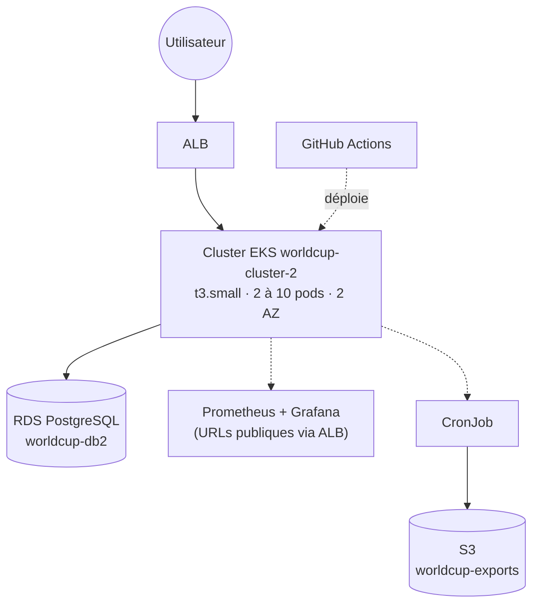
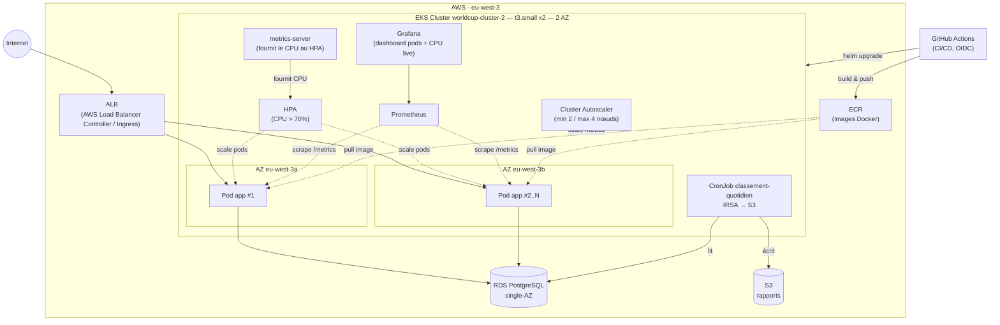

# Schéma d'architecture

> Diagramme source (Mermaid), à exporter en PNG (draw.io / Excalidraw / capture
> d'écran du rendu Mermaid) pour la slide de soutenance → `docs/architecture.png`.

## Version simplifiée (pour la slide de présentation)

Cette version garde juste l'essentiel pour une slide lisible à distance : le
chemin de la requête (Utilisateur → ALB → EKS → RDS) + les 3 briques annexes
(observabilité, Job, CI/CD) sans détailler chaque flèche technique.

## Version détaillée (pour répondre aux questions techniques)

## Lecture du schéma

1. **Internet → ALB** : point d'entrée public, répartit le trafic entre les pods.
2. **2 AZ** : les pods sont répartis sur deux zones de disponibilité → haute dispo.
3. **HPA** : ajoute/retire des pods selon le CPU (élasticité applicative).
4. **Cluster Autoscaler** : ajoute/retire des nœuds EC2 quand les pods ne tiennent
   plus sur les machines existantes (élasticité infra, nécessaire pour les pics de
   charge type 100k utilisateurs).
5. **RDS PostgreSQL single-AZ** : seul composant stateful, géré par AWS, hors du
   cluster.
6. **metrics-server** : collecte le CPU/RAM réel des pods, c'est la seule
   source d'info du HPA — sans lui, aucun scaling n'est possible.
7. **Prometheus + Grafana** : Prometheus scrape `/metrics` (déjà exposé par
   l'app), Grafana affiche les dashboards en direct. Dashboard custom "Worldcup —
   Pods en temps réel" : nombre de pods Running + CPU % (refresh 5s, double axe Y).
   Les deux sont accessibles publiquement via Ingress ALB.
7. **CronJob** : tâche planifiée (Mission 3) qui lit la base et dépose un rapport
   JSON sur S3.
8. **GitHub Actions** : à chaque push sur `main`, build l'image, la pousse sur ECR,
   puis déploie via `helm upgrade` (authentification AWS par OIDC, sans clé statique).
