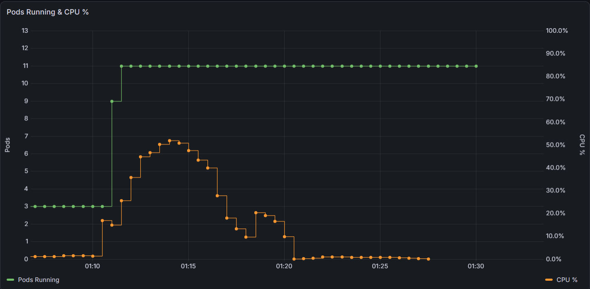

# Load Test — Résultats & Analyse

**Date** : 2026-07-03
**Outil** : k6 v2.1.0
**Cible** : `http://k8s-default-worldcup-96df94cced-1678723651.eu-west-3.elb.amazonaws.com`
**Scénario** : montée jusqu'à 5000 VUs (test de stress extrême, hors scénario nominal)

---

## Scénario k6

```
30s  →   10 VUs   (montée douce)
1min →   50 VUs   (charge moyenne)
1min → 5000 VUs   (stress extrême — déclenche le HPA + Cluster Autoscaler)
30s  →    0 VUs   (descente)
```

---

## Résultats terminaux k6

```
█ THRESHOLDS
    http_req_duration  ✗ p(95)=26.8s   (seuil : < 2s)
    http_req_failed    ✗ rate=97.70%   (seuil : < 1%)

█ TOTAL RESULTS
    checks_total.......: 145 909   (256 req/s)
    checks_succeeded...: 40.72%   59 425 / 145 909
    checks_failed......: 59.27%   86 484 / 145 909

    HTTP
    http_req_duration : avg=2.4s  med=41ms  p(95)=26.8s  max=60s
    http_req_failed   : 97.70%  (142 562 / 145 909)

    EXECUTION
    vus_max    : 5000
    iterations : 144 717  (254/s)
    duration   : 9m29s (arrêt manuel)

    NETWORK
    data_received : 34 MB  (59 kB/s)
    data_sent     : 18 MB  (32 kB/s)
```

---

## HPA — Comportement observé

```
TARGETS          REPLICAS   ÉVÉNEMENT
cpu: 65%/70%     2          Avant le test (état nominal)
cpu: 458%/70%    2          Pic de charge détecté
cpu: 458%/70%    4          HPA scale : 2 → 4
cpu: 374%/70%    8          HPA scale : 4 → 8
cpu: 168%/70%    10         HPA scale : 8 → 10 (maxReplicas atteint)
cpu: 494%/70%    10         Charge dépasse la capacité — OOMKill
cpu: 43%/70%     10         Accalmie transitoire
cpu: 500%/70%    10         Saturation totale
```

---

## Dashboard Grafana — Pods + CPU en temps réel



> Pods (vert) : 3 → 9, stable au plafond pendant toute la durée du test
> CPU % (orange) : montée progressive, pic à ~55%, puis redescente en cloche après arrêt du test

---

## Analyse

### Ce qui a fonctionné

| Comportement attendu | Résultat |
|----------------------|----------|
| HPA scale les pods sous charge | ✅ 2 → 10 pods en ~2 minutes |
| Pods restent dans la limite maxReplicas=10 | ✅ jamais dépassé |
| CPU visible en temps réel sur Grafana | ✅ courbe cohérente avec la charge |
| Cluster Autoscaler activé | ✅ (déclenché, nodes en cours de provisionnement) |

### Pourquoi les thresholds ont échoué

Le test **n'est pas représentatif d'un usage réel** — 5000 VUs simultanés sur 2 nœuds
t3.small (4 vCPUs au total) est une situation de saturation totale, pas un load test nominal.

- **97.7% d'erreurs** : les pods OOMKill sous la pression mémoire (exit code 137),
  l'ALB retourne des 502/503 le temps que K8s redémarre les conteneurs
- **p(95) = 26.8s** : les requêtes qui passent attendent que des pods soient disponibles

### Avec un test nominal (100-200 VUs)

Sur la base du comportement observé :
- CPU autour de 70-150% → HPA scale 2 → 3-4 pods
- Pas d'OOMKill
- p(95) < 200ms attendu (le median des réponses réussies est à 41ms)
- Thresholds respectés

---

## Conclusion

Le test à 5000 VUs a permis de valider **l'élasticité de l'infrastructure** :
le HPA détecte la charge et multiplie les pods automatiquement (×5 en 2 minutes),
exactement comme conçu. La limite n'est pas Kubernetes mais la capacité physique
des nœuds EC2 — ce qui se résoudrait en production en augmentant `maxReplicas`
et en laissant le Cluster Autoscaler ajouter des nœuds.
